# DBMSLAB WEEK2
# Sailors table creation
```
CREATE TABLE Sailors (
    sid NUMBER PRIMARY KEY,
    sname VARCHAR2(50) NOT NULL,
    rating NUMBER NOT NULL,
    age NUMBER(4,1) NOT NULL
);
```
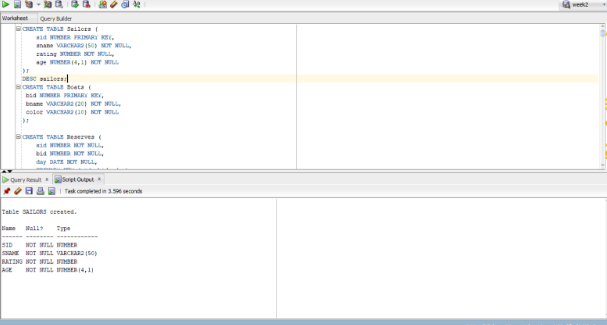
# Boats table creation
```
CREATE TABLE Boats (
 bid NUMBER PRIMARY KEY,
 bname VARCHAR2(20) NOT NULL,
 color VARCHAR2(10) NOT NULL
);
```
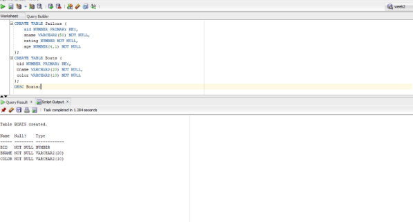
# reserves table creation
```
CREATE TABLE Reserves (
    sid NUMBER NOT NULL,
    bid NUMBER NOT NULL,
    day DATE NOT NULL,
    PRIMARY KEY (sid, bid, day),
    FOREIGN KEY (sid) REFERENCES Sailors(sid),
    FOREIGN KEY (bid) REFERENCES Boats(bid)
);
```
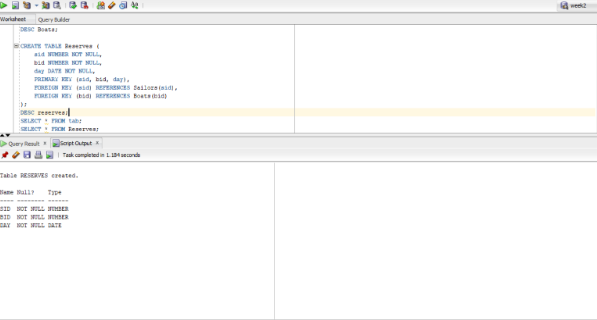

# INSERT Sailors 
```
INSERT INTO Sailors VALUES (22, 'Dustin', 7, 45.0);
INSERT INTO Sailors VALUES (29, 'Brutus', 1, 33.0);
INSERT INTO Sailors VALUES (31, 'Lubber', 8, 55.5);
INSERT INTO Sailors VALUES (32, 'Andy', 8, 25.5);
INSERT INTO Sailors VALUES (58, 'Rusty', 10, 35.0);
INSERT INTO Sailors VALUES (64, 'Horatio', 7, 35.0);
INSERT INTO Sailors VALUES (71, 'Zorba', 10, 16.0);
INSERT INTO Sailors VALUES (74, 'Horatio', 9, 35.0);
INSERT INTO Sailors VALUES (85, 'Art', 3, 25.5);
INSERT INTO Sailors VALUES (95, 'Bob', 3, 63.5);
```
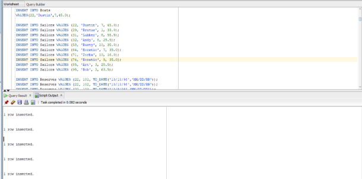
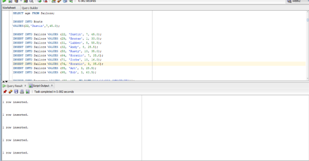
# INSERT Reserves 
```
INSERT INTO Reserves VALUES (22, 101, TO_DATE('10/10/98','MM/DD/RR'));
INSERT INTO Reserves VALUES (22, 102, TO_DATE('10/10/98','MM/DD/RR'));
INSERT INTO Reserves VALUES (22, 103, TO_DATE('10/8/98','MM/DD/RR'));
INSERT INTO Reserves VALUES (22, 104, TO_DATE('10/7/98','MM/DD/RR'));
INSERT INTO Reserves VALUES (31, 102, TO_DATE('11/10/98','MM/DD/RR'));
INSERT INTO Reserves VALUES (31, 103, TO_DATE('11/6/98','MM/DD/RR'));
INSERT INTO Reserves VALUES (31, 104, TO_DATE('11/12/98','MM/DD/RR'));
INSERT INTO Reserves VALUES (31, 104, TO_DATE('11/12/98','MM/DD/RR'));
INSERT INTO Reserves VALUES (64, 101, TO_DATE('9/5/98','MM/DD/RR'));
INSERT INTO Reserves VALUES (64, 102, TO_DATE('9/8/98','MM/DD/RR'));
INSERT INTO Reserves VALUES (74, 103, TO_DATE('9/8/98','MM/DD/RR'));
```
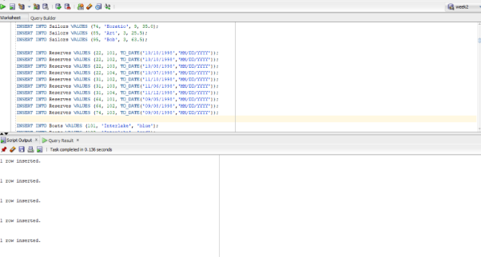
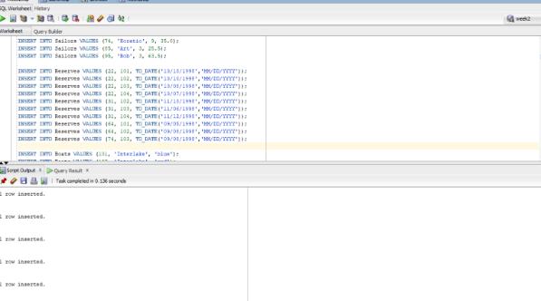
#INSERT Boats 
```
INSERT INTO Boats VALUES (101, 'Interlake', 'blue');
INSERT INTO Boats VALUES (102, 'Interlake', 'red');
INSERT INTO Boats VALUES (103, 'Clipper', 'green');
INSERT INTO Boats VALUES (104, 'Marine', 'red');
```
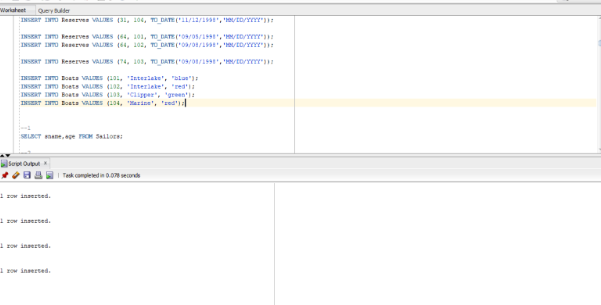
# Describing of tables
DESC sailors;
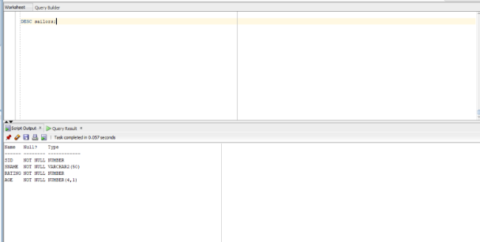
DESC reserves;
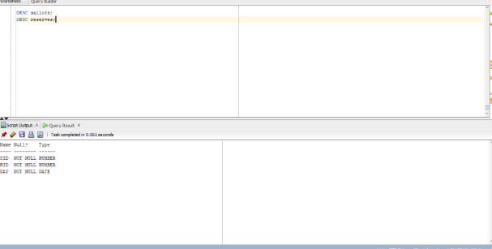
DESC boats;
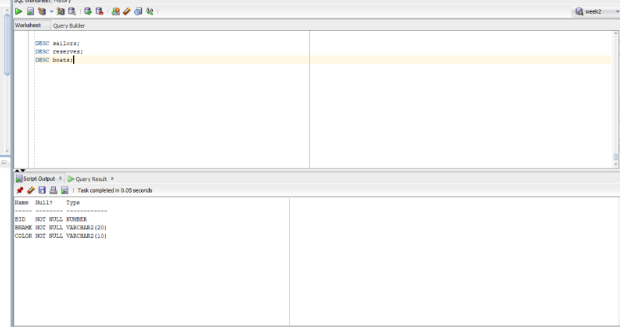
# Displaying of tables

SELECT * FROM Sailors;

SELECT * FROM Reserves;

SELECT * FROM Boats;
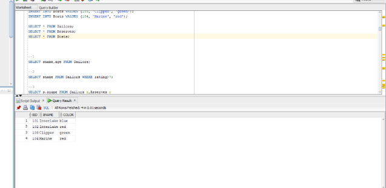
# q1
```
SELECT sname,age FROM Sailors;
```
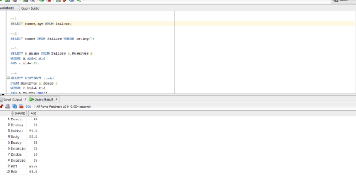
# q2

```
SELECT sname FROM Sailors WHERE rating>7;
```
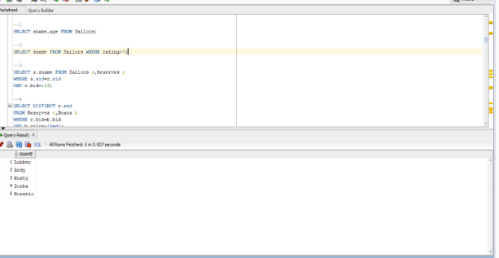
# q3
```
SELECT s.sname FROM Sailors s,Reserves r
WHERE s.sid=r.sid
AND r.bid=103;
```
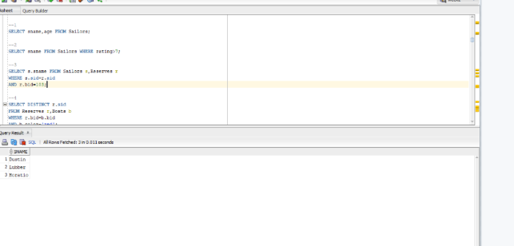
# q4
```
SELECT DISTINCT r.sid
FROM Reserves r,Boats b
WHERE r.bid=b.bid
AND b.color='red';
```
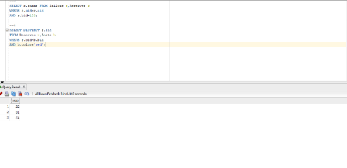
# q5
```
SELECT  DISTINCT s.sname FROM Sailors s,Reserves r,Boats b
WHERE s.sid=r.sid
AND r.bid=b.bid
AND b.color='red';
```
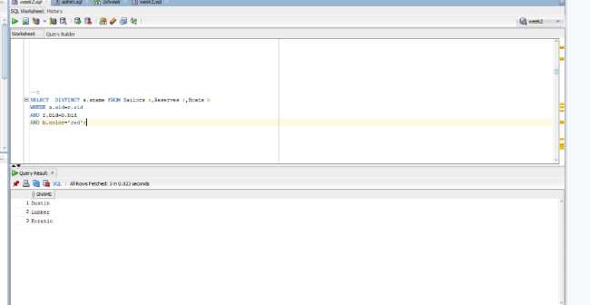
# q6
```
SELECT b.color FROM Sailors s,Reserves r,Boats b
WHERE s.sid=r.sid
AND r.bid=b.bid
AND s.sname='Lubber';
```
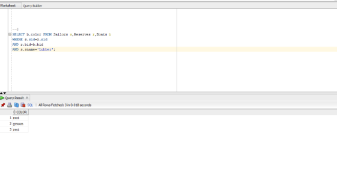
# q7
```
SELECT DISTINCT s.sname FROM Sailors s,Reserves r
WHERE s.sid=r.sid;
```
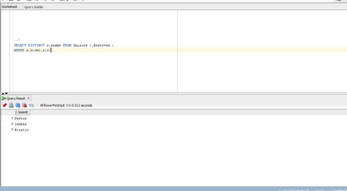
# q8
```
SELECT DISTINCT s.sname,rating+1 AS incremented_rating
FROM Sailors s,Reserves r1,Reserves r2
WHERE s.sid=r1.sid AND r1.sid=r2.sid
```

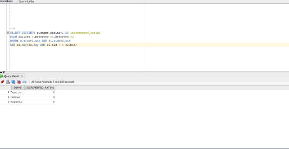
# q9
```
SELECT age
FROM Sailors
WHERE sname LIKE 'B%b'
AND LENGTH(sname) >= 3;
```
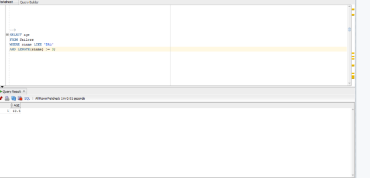
# q10
```
SELECT s.sname FROM Sailors s,Reserves r,Boats b
WHERE s.sid=r.sid
AND r.bid=b.bid
AND(b.color='red' OR b.color='green');
```
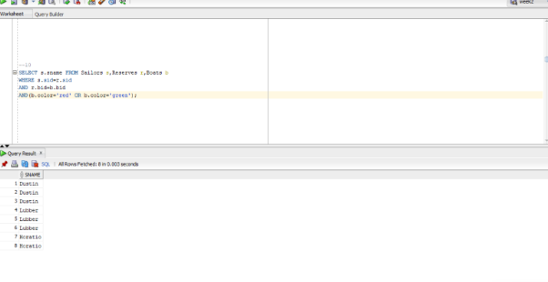
# q11
```
SELECT s.sname
FROM Sailors s
WHERE s.sid IN
(
    SELECT r.sid
    FROM Reserves r, Boats b
    WHERE r.bid = b.bid
    AND b.color = 'red'
)
AND s.sid IN
(
    SELECT r.sid
    FROM Reserves r, Boats b
    WHERE r.bid = b.bid
    AND b.color = 'green'
);
```
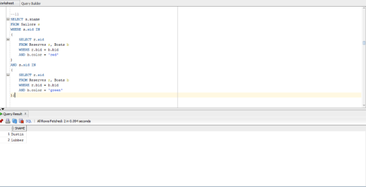
# q12
```
SELECT DISTINCT r.sid
FROM Reserves r, Boats b
WHERE r.bid = b.bid
AND b.color = 'red'
AND r.sid NOT IN
(
    SELECT r2.sid
    FROM Reserves r2, Boats b2
    WHERE r2.bid = b2.bid
    AND b2.color = 'green'
);
```
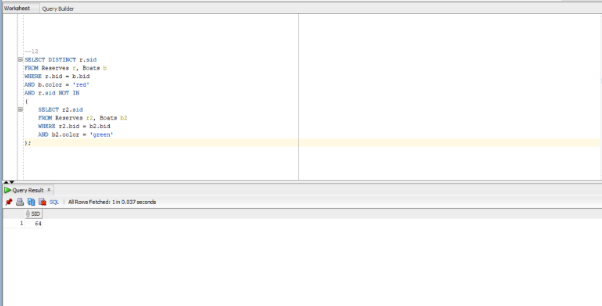
# q13
```
SELECT sid
FROM Sailors
WHERE rating = 10

UNION

SELECT sid
FROM Reserves
WHERE bid = 104;
```
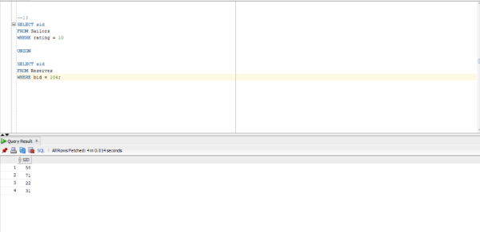
# q14
```
SELECT DISTINCT s.sname
FROM Sailors s, Reserves r
WHERE s.sid = r.sid
AND r.bid = 103;
```
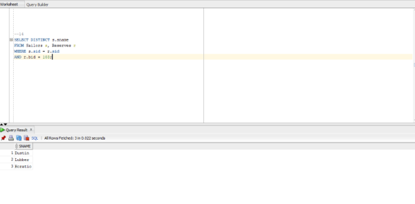
# q15
```
SELECT DISTINCT s.sname
FROM Sailors s, Reserves r, Boats b
WHERE s.sid = r.sid
AND r.bid = b.bid
AND b.color = 'red';
```
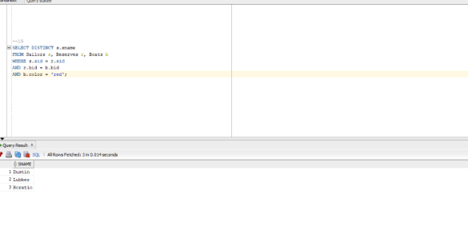
# q16
```
SELECT DISTINCT s.sname
FROM Sailors s, Reserves r
WHERE s.sid = r.sid
AND r.bid = 103;
```
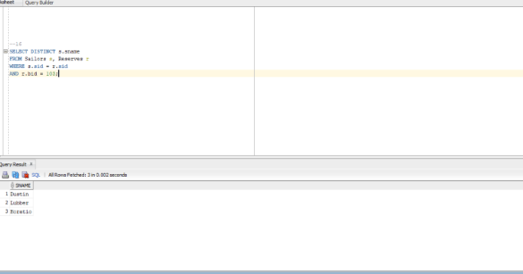
# q17
```
SELECT * FROM Sailors
WHERE rating > ANY
(
    SELECT rating
    FROM Sailors
    WHERE sname = 'Horatio'
);
```
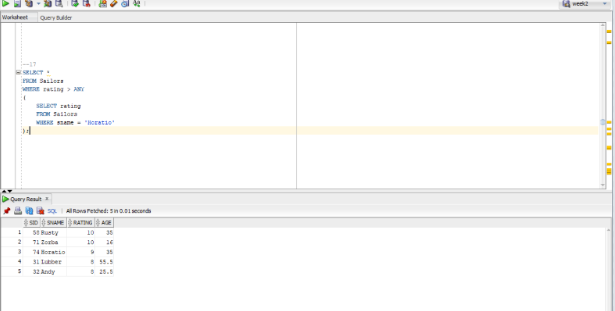
# q18
```
SELECT * FROM Sailors
(
    SELECT rating
    FROM Sailors
    WHERE sname = 'Horatio'

);
```
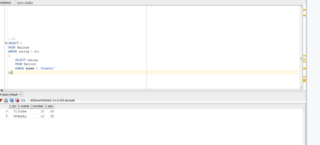
# q19
```
SELECT * FROM Sailors
WHERE rating =
(
    SELECT MAX(rating)
    FROM Sailors
);
```
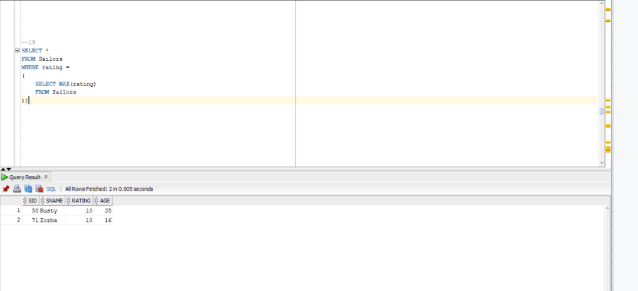
# q20
```
SELECT s.sname
FROM Sailors s
WHERE s.sid IN
(
    SELECT r.sid
    FROM Reserves r, Boats b
    WHERE r.bid = b.bid
    AND b.color = 'red'
)
AND s.sid IN
(

    SELECT r.sid
    FROM Reserves r, Boats b
    WHERE r.bid = b.bid
    AND b.color = 'green'
);
```

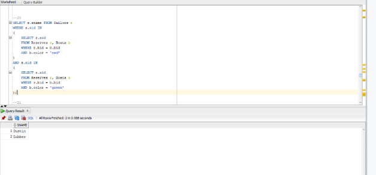
# q21
```
SELECT s.sname FROM Sailors s
WHERE NOT EXISTS
(
    SELECT * FROM Boats b

    WHERE NOT EXISTS
    (
        SELECT *
        FROM Reserves r
        WHERE r.sid = s.sid
        AND r.bid = b.bid
    )
);
```
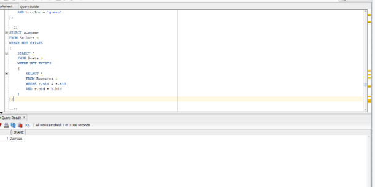
# q22

```
SELECT AVG(age)
FROM Sailors;
```
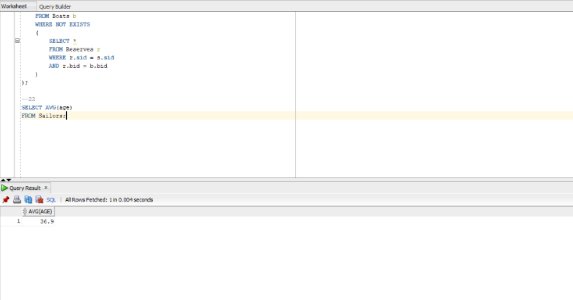
# q23
```
SELECT AVG(age)
FROM Sailors
WHERE rating = 10;
```
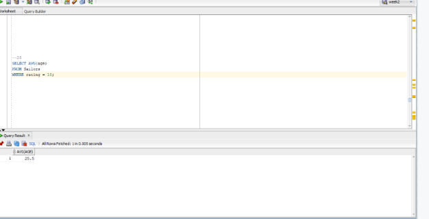
# q24
```
SELECT sname, age
FROM Sailors
WHERE age =
(
    SELECT MAX(age)
    FROM Sailors
);
```
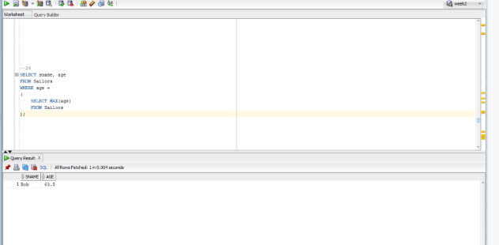
# q25

```
SELECT COUNT(*)
FROM Sailors;
```
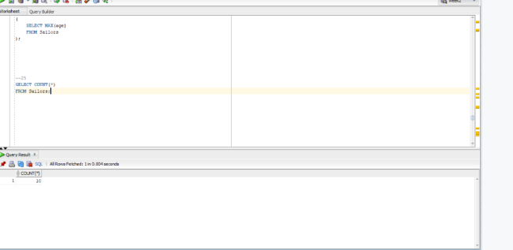
# q26
```
SELECT COUNT(DISTINCT sname)
FROM Sailors;
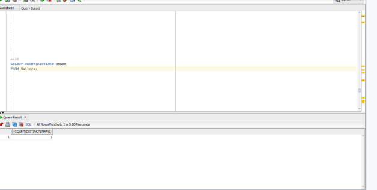

# q27
```
SELECT sname
FROM Sailors

WHERE age >
(
    SELECT MAX(age)

    FROM Sailors
    WHERE rating = 10

);
```

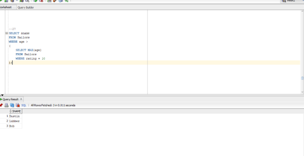
# q28
```
SELECT rating, MIN(age)

FROM Sailors
GROUP BY rating;

```
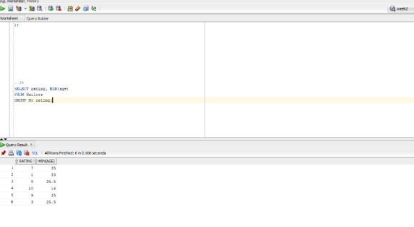
# q29

```

SELECT rating, MIN(age)

FROM Sailors
WHERE age >= 18

GROUP BY rating
HAVING COUNT(*) >= 2;

```
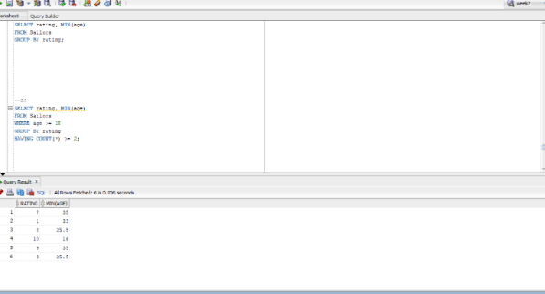
# q30
```
SELECT b.bid, COUNT(r.sid) AS reservations
FROM Boats b
LEFT JOIN Reserves r
ON b.bid = r.bid
WHERE b.color = 'red'
GROUP BY b.bid;
```
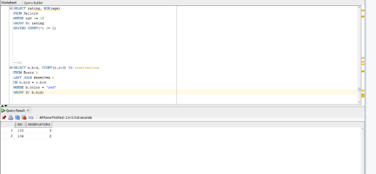
# q31
```
SELECT rating, AVG(age)
FROM Sailors
GROUP BY rating
HAVING COUNT(*) >= 2;
```
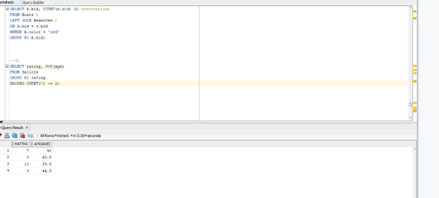
# q31
```
SELECT rating, AVG(age)
FROM Sailors
WHERE age >= 18
GROUP BY rating
HAVING COUNT(*) >= 2;
```

# q32
```
SELECT rating, AVG(age)
FROM Sailors
WHERE age >= 18
GROUP BY rating
HAVING COUNT(*) >= 2;
```
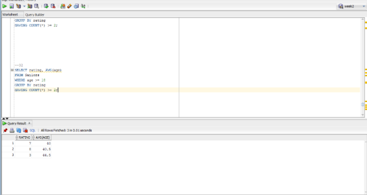
# q33
```
SELECT rating, AVG(age)
FROM Sailors
WHERE age >= 18
GROUP BY rating
HAVING COUNT(*) >= 2;
```
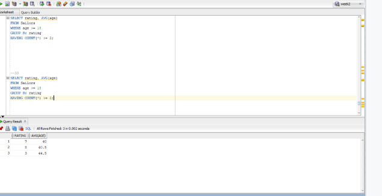
# q34
```
SELECT rating
FROM Sailors
GROUP BY rating
HAVING AVG(age) =
(
    SELECT MIN(avg_age)
    FROM
    (
        SELECT AVG(age) AS avg_age
        FROM Sailors
        GROUP BY rating
    ) x
);
```

